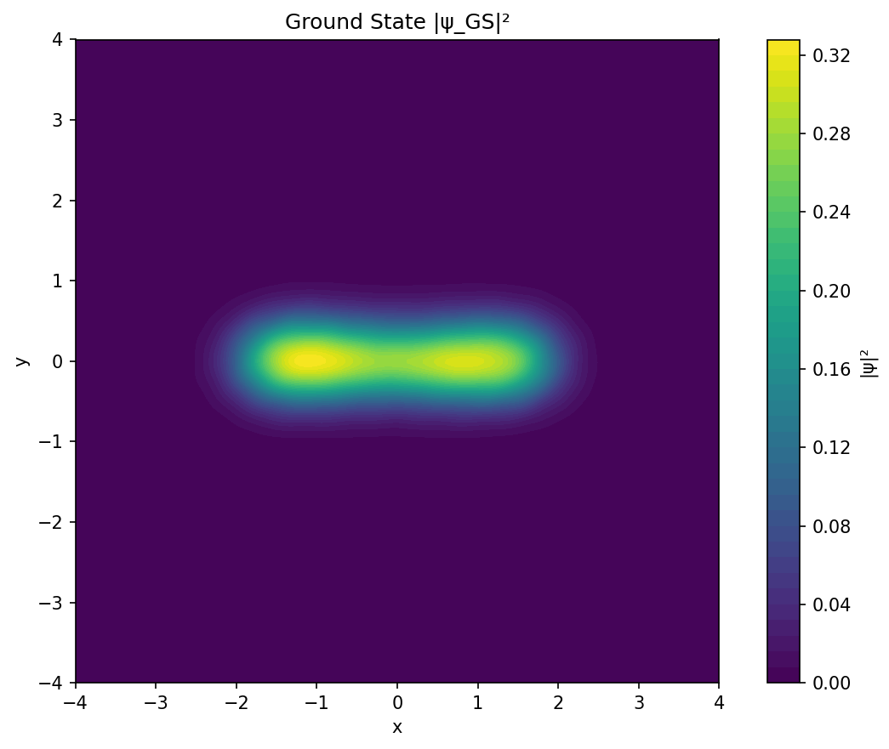
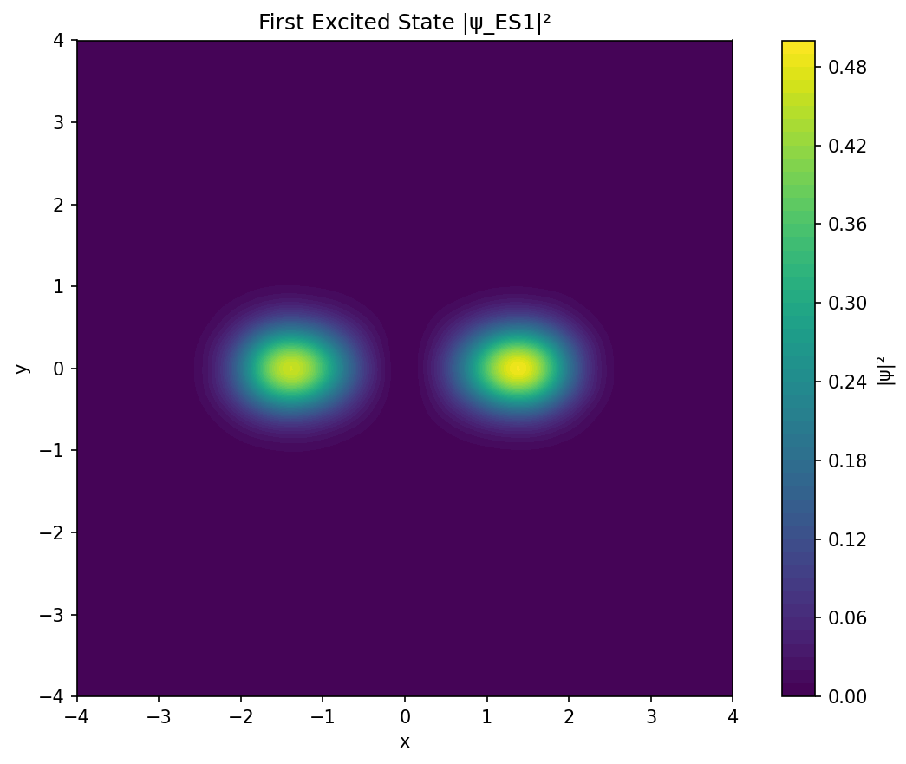
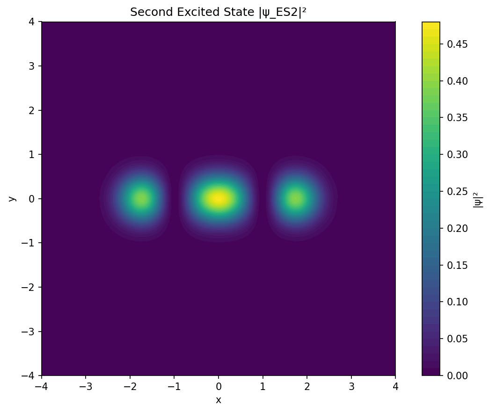

# Physics-Informed Neural Solver for GaAs Double Quantum Dots

**A mesh-free deep learning framework for solving the stationary Schrödinger equation in semiconductor heterostructures.**

This repository implements a **Physics-Informed Neural Network (PINN)** to solve for the single-electron eigenstates of a Gallium Arsenide (GaAs) Double Quantum Dot (DQD). By leveraging **Sinusoidal Representation Networks (SIRENs)** and a variational Rayleigh–Ritz objective, this solver resolves the ground state and excited states of realistic, soft-walled confining potentials without the need for finite element meshing or basis set expansion.

The project demonstrates the capability of PINNs to capture critical quantum mechanical features—including tunneling, nodal structures, and energy splitting—essential for modeling spin qubits in quantum information science.

-----

## 1\. Physical System & Hamiltonian

The system models a single electron confined in a 2D GaAs heterostructure. Unlike idealized textbook models (infinite square wells), realistic gate-defined quantum dots exhibit "soft" confinement best described by polynomial potentials.

### The Hamiltonian

We solve the time-independent Schrödinger equation in the effective mass approximation:

$$
\left[-\frac{\hbar^2}{2 m^*}\left(\frac{\partial^2}{\partial x^2} + \frac{\partial^2}{\partial y^2}\right) + V(x,y)\right] \psi(x,y) = E \psi(x,y)
$$

**System Parameters:**

  * **Material:** GaAs ($m^* = 0.067 m_0$).
  * **Energy Scale:** Eigenvalues are computed in dimensionless units and scaled to meV ($E_0 \approx 0.6318$ meV).
  * **Domain:** $\Omega = [-4, 4] \times [-4, 4]$ (dimensionless).

### The Confining Potential

The double quantum dot is modeled by a **biquadratic potential** $V(x,y)$, representing two potential minima separated by a central tunnel barrier.

The potential landscape is defined by:

  * **$a$ (Inter-dot separation):** Controls the tunnel barrier width. Increasing $a$ reduces the tunnel coupling $t$.
  * **$\hbar\omega_x, \hbar\omega_y$ (Confinement strength):** Controls the curvature of the wells. We utilize $\hbar\omega_x = 3.0$ meV and $\hbar\omega_y = 5.0$ meV, creating an anisotropic confinement that pushes vertical ($y$-mode) excitations to higher energies.

-----

## 2\. Methodology: Variational PINN

Standard PINNs often struggle with eigenvalue problems where the trivial solution ($\psi=0$) is a valid local minimum. We overcome this using a composite loss function designed for quantum mechanics.

### Architecture

We employ a **SIREN (Sinusoidal Representation Network)**. unlike `tanh` or `ReLU` networks, SIRENs use periodic activation functions ($\sin(Wx + b)$). This allows the network to accurately model the oscillatory nature of wavefunctions and provides stable, non-vanishing second derivatives ($\nabla^2\psi$) required for the kinetic energy operator.

### Loss Landscape

The network minimizes a physical loss function $\mathcal{L}$:

$$\mathcal{L} = w_{RR}\mathcal{L}_{Rayleigh} + w_{PDE}\mathcal{L}_{Residual} + w_{norm}\mathcal{L}_{Norm} + w_{ortho}\mathcal{L}_{Ortho}$$

1.  **Rayleigh–Ritz Energy ($\mathcal{L}_{Rayleigh}$):** Variational upper bound on the energy. Minimizing this drives the network toward the ground state.
2.  **PDE Residual ($\mathcal{L}_{Residual}$):** Enforces the Schrödinger equation locally at thousands of collocation points, ensuring the solution is valid everywhere, not just on average.
3.  **Orthogonality ($\mathcal{L}_{Ortho}$):** Crucial for finding excited states. We enforce $\langle \psi_n | \psi_{m < n} \rangle = 0$, forcing the network to discover new, higher-energy states rather than collapsing back to the ground state.

-----

## 3\. Results & Discussion

The solver successfully isolated the Ground State (GS), First Excited State (ES1), and Second Excited State (ES2).

### Energy Spectrum

The calculated eigenvalues reveal the distinct energy scales of the system:

| State | Energy (meV) | Splitting (meV) | Interpretation |
| :--- | :--- | :--- | :--- |
| **GS** | 3.736 | -- | Bonding orbital (Symmetric) |
| **ES1** | 3.975 | 0.239 | Antibonding orbital (Anti-symmetric) |
| **ES2** | 5.630 | 1.654 | Second harmonic in $x$ ($n_x=2$) |

**Key Observations:**

1.  **Tunnel Splitting ($2t$):** The gap between GS and ES1 is $\approx 0.24$ meV. This corresponds to the tunnel coupling energy, a critical parameter for singlet-triplet qubit operations. The small splitting indicates the two dots are distinct but coupled.
2.  **Gap to ES2:** The large jump to ES2 ($\approx 1.65$ meV) confirms that the system is in the "quantum dot" regime, where orbital quantization energy is significantly larger than the tunnel splitting.

### Wavefunction Analysis

#### Ground State (Bonding)

The ground state $\psi_0$ exhibits **even parity** (symmetric). The electron density is delocalized across both dots with a non-zero probability in the center, signifying quantum tunneling.

  * *Center of Mass:* Near origin $(0.0, -0.04)$.
  * *Left/Right Mass:* Balanced ($0.498$ vs $0.502$).

#### First Excited State (Antibonding)

The first excited state $\psi_1$ exhibits **odd parity** along the inter-dot axis ($x$). A sharp **nodal line** at $x=0$ separates the two lobes. This state corresponds to the "antibonding" molecular orbital, where destructive interference prevents the electron from occupying the tunnel barrier.

#### Second Excited State ($n_x=2$ Mode)

The second excited state displays a three-lobe structure aligned along the $x$-axis. This identifies it as the second excitation in the longitudinal direction ($n_x=2, n_y=0$) rather than a transverse excitation ($n_x=0, n_y=1$). This is consistent with our confinement parameters, where the $y$-confinement ($\hbar\omega_y = 5$ meV) is stiffer than the $x$-confinement.

### Density Visualizations

| State | Density Plot |
| --- | --- |
| Ground State |  |
| First Excited (ES1) |  |
| Second Excited (ES2) |  |

Each plot is generated directly from the notebook run and lives under `results/<state>/`.

-----

## 4\. Notebook Usage & Reproduction

The **Jupyter/Colab notebook is the primary entry point** for this project. It bundles the physical constants, model definitions, training loop, diagnostics, and artifact export into a single executable document.

### Run on Google Colab (recommended)
1. Open [Google Colab](https://colab.research.google.com/) and upload `train_dqd_colab.ipynb`, or open it directly from this repository.
2. Set the runtime to GPU (optional but speeds up training).
3. Run all cells. The notebook sequentially trains GS - ES1 - ES2, storing outputs in `colab_results/state_gs`, `state_es1`, and `state_es2`.
4. Download the generated folders if you want to analyze them locally; they follow the same structure demonstrated in `results/`.

### Run locally
1. Install dependencies into a virtual environment:
   ```bash
   python -m venv .venv
   source .venv/bin/activate   # Windows: .venv\Scripts\Activate.ps1
   pip install --upgrade pip
   pip install torch numpy scipy matplotlib seaborn tqdm jupyterlab
   ```
2. Launch JupyterLab and open `train_dqd_colab.ipynb`.
3. Execute the notebook; artifacts will be written to `colab_results/` by default. You can change the root directory in the configuration cell.

### What the notebook saves
- `model_best.pt`, `config.json`, `params.txt` per state.
- `energies.txt`, `history.json/csv`, `density_features.json/csv`.
- Plots (`psi_density.png`, `training_history.png`, potential snapshots) and raw grids (`psi_grid.pt`, `*_wavefunction_*.npy`).

The `results/` directory in this repository is a snapshot of such a run for quick inspection.

> **Note:** The CLI scripts in `src/` share the same core logic, but we focus documentation and support on the notebook workflow for reproducibility.

-----

## 5\. Repository Structure

  * `src/`: Source code for the PINN model, physics utilities, and training loops.
  * `train_dqd_colab.ipynb`: Main executable notebook.
  * `results/`: Artifacts from the reference experiment (plots, energies, logs).
  * `data/`: Default output directory for local runs.
  * `docs/`: Supplementary documentation.

-----

## Citation

If you use this code or methodology in your research, please cite:

```bibtex
@misc{pinn_dqd_2025,
  title = {Physics-Informed Neural Solver for Double Quantum Dot Eigenstates},
  author = {Mihir Shrivastava},
  year = {2025},
  howpublished = {https://github.com/MihirShrivastav/QDot-PINN},
  note = {SIREN PINN implementation for GaAs DQDs}
}
```
